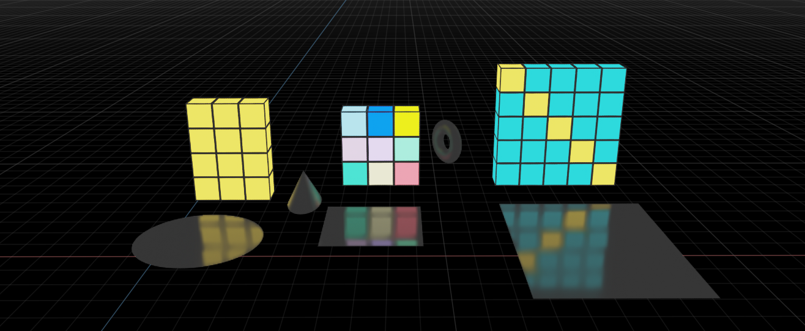
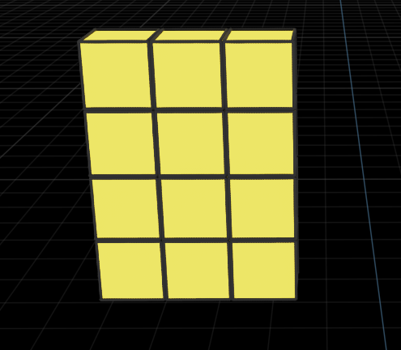
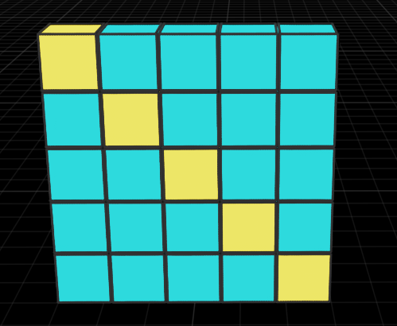
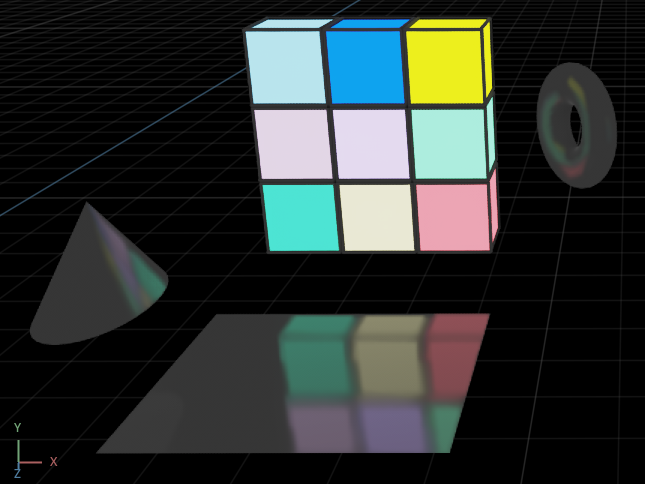

# Enabling the extension
1. Navigate to the extension tab and search for 'lightcube' in the community section
2. Toggle the enable button to start playing with the extension. 
3. Please note, inorder to use the extension you will need the source asset for the same. It is located in the extension repo path: [exts\light_box.cube.v1\light_box\cube\v1\assets\lightcube.usd](https://github.com/hackassin/light-cube-matrix/blob/main/exts/light_box.cube.v1/light_box/cube/v1/assets/lightcube.usd)


# Using the extension
1. You must create a new XForm. After creating, head to Edit tab in Omniverse Code and click on 'unparent' to move the XForm out of the Root/World primitive. 
2. Once the above is done, drag the lightcube_asset.usd file to XForm group.
3. On the extension UI window, titled 'LightCube Generator' you can find the fields for specifying number of rows and columns for the lightcube matrix. 
4. Click on each field and drag/enter your desired dimensions. 
5. Below that you shall notice the 'PatternType' field which is meant for specifying the lightcube matrix color pattern. 
6. Choose your pattern type out of 'Plain' (singular color), 'Diagonal' (diagonally singular color) and 'Random' (random colors).
7. Hit the generate button to produce your LightCube Matrix.

# Supported Pattern Types
Currently, only three pattern types are supported. They are:

## Plain
Generates lightcube matrix with cubes having the same color


## Diagonal
Generates lightcube matrix with the diagonal cubes only retaining the same color.
  

## Random
Generates a randomized color pattern for all the cubes in the matrix. 
  

# Extension Project Template

This project was automatically generated.

- `app` - It is a folder link to the location of your *Omniverse Kit* based app.
- `exts` - It is a folder where you can add new extensions. It was automatically added to extension search path. (Extension Manager -> Gear Icon -> Extension Search Path).

Open this folder using Visual Studio Code. It will suggest you to install few extensions that will make python experience better.

Look for "light_box.cube.test" extension in extension manager and enable it. Try applying changes to any python files, it will hot-reload and you can observe results immediately.

Alternatively, you can launch your app from console with this folder added to search path and your extension enabled, e.g.:

```
> app\omni.code.bat --ext-folder exts --enable company.hello.world
```

# App Link Setup

If `app` folder link doesn't exist or broken it can be created again. For better developer experience it is recommended to create a folder link named `app` to the *Omniverse Kit* app installed from *Omniverse Launcher*. Convenience script to use is included.

Run:

```
> link_app.bat
```

If successful you should see `app` folder link in the root of this repo.

If multiple Omniverse apps is installed script will select recommended one. Or you can explicitly pass an app:

```
> link_app.bat --app create
```

You can also just pass a path to create link to:

```
> link_app.bat --path "C:/Users/bob/AppData/Local/ov/pkg/create-2021.3.4"
```


<!-- # Sharing Your Extensions

This folder is ready to be pushed to any git repository. Once pushed direct link to a git repository can be added to *Omniverse Kit* extension search paths.

Link might look like this: `git://github.com/[user]/[your_repo].git?branch=main&dir=exts`

Notice `exts` is repo subfolder with extensions. More information can be found in "Git URL as Extension Search Paths" section of developers manual.

To add a link to your *Omniverse Kit* based app go into: Extension Manager -> Gear Icon -> Extension Search Path -->